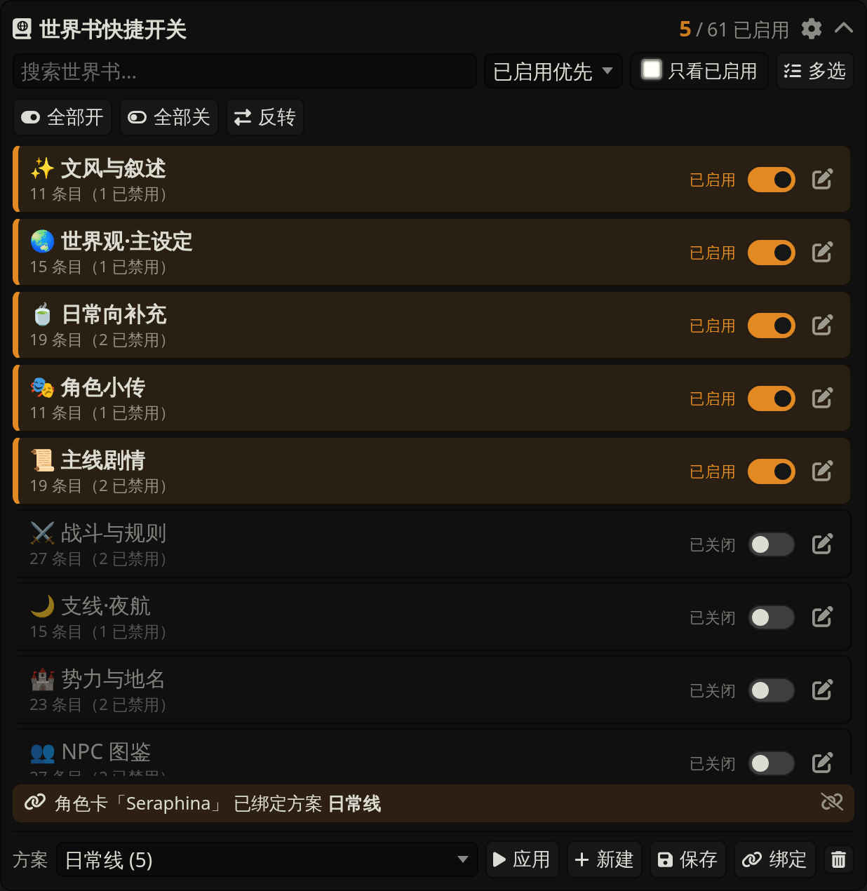
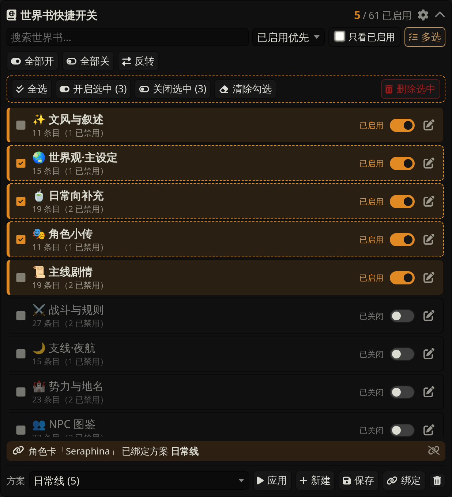
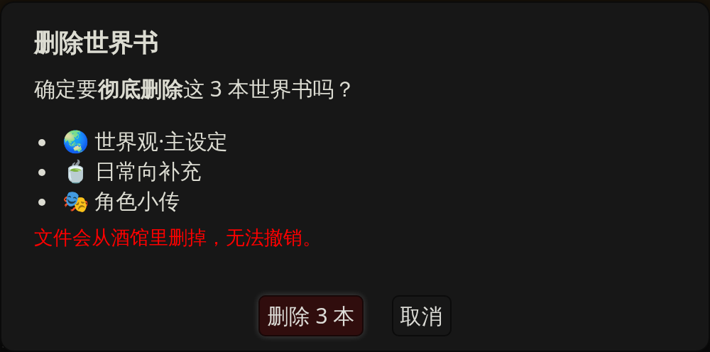
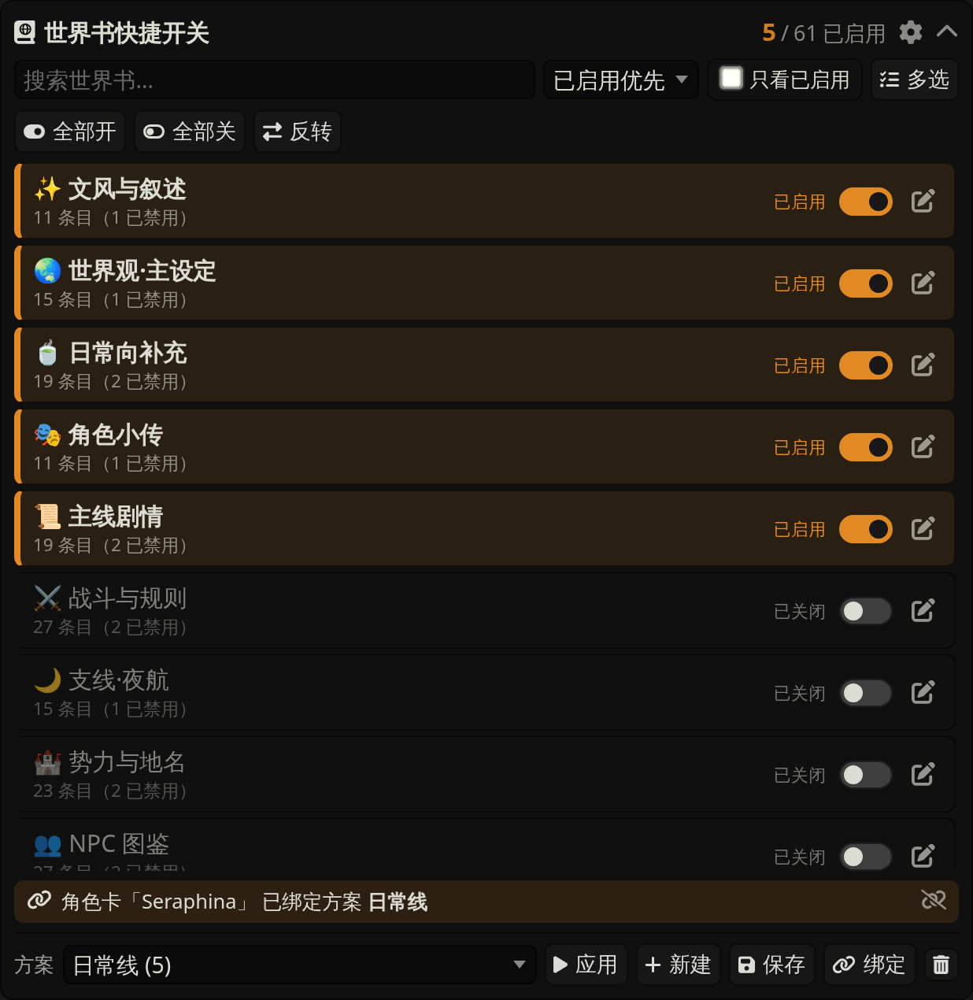
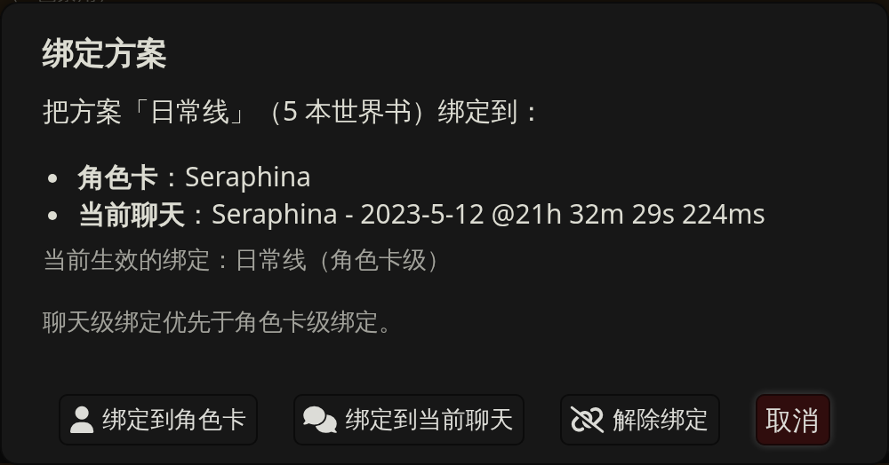
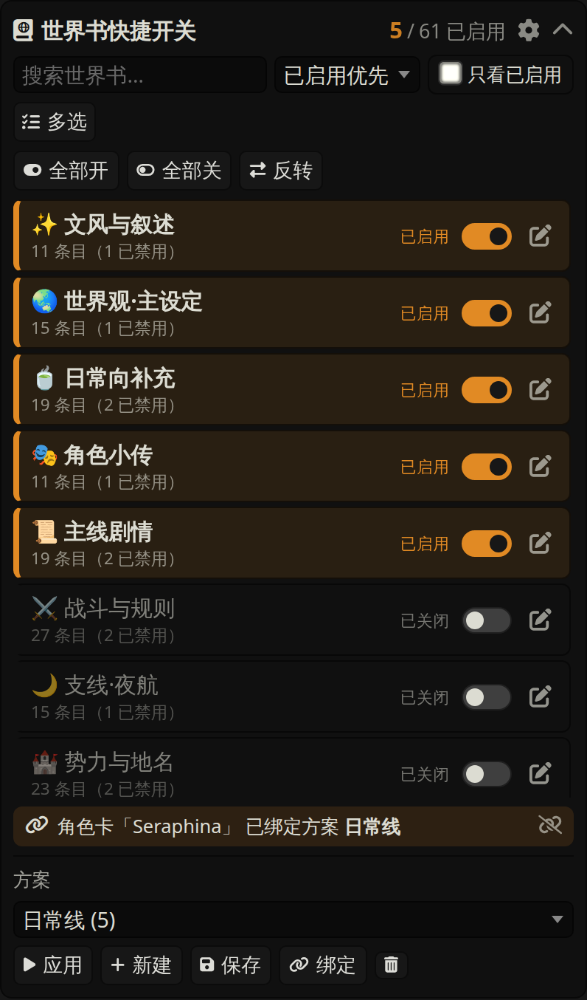

# 世界书快捷开关 · World Book Quick Switch

> 一个 SillyTavern 扩展：让全局世界书的开关状态**一眼看得清**，开关**一点就切**，
> 常用组合存成方案，还能把方案绑到角色卡或某个聊天，切过去自动套用。



## 为什么

酒馆的全局世界书用的是一个多选下拉框：勾没勾上看不清，开一本关一本要反复点开下拉、
在几十上百本里找名字，切个场景要点半天。

这个扩展**直接接管**了它——世界书抽屉顶部换成上面这块面板，一本一行、一个开关、
一个状态标签。原生那条会自动隐藏，装上即用，不需要任何设置。

## 功能

- **状态一目了然** — 已启用的书有高亮底色、左侧色条、`已启用` 标签和实心开关；
  标题栏常驻 `已启用 / 总数` 计数。
- **点一下就切** — 点整行任意位置开 / 关，不用再进下拉框。
- **多选批量** — 点「多选」进入多选模式，勾选若干本后「开启选中 / 关闭选中」，
  也能**批量删除**世界书；`Shift` 点击可一次勾一整段。
- **全部开 / 全部关 / 反转** — 「全部开 / 全部关」只作用于当前列表，配合搜索就是
  「把所有带『战斗』的世界书一键打开」。
- **搜索 / 排序 / 只看已启用** — 上百本也能秒定位。
- **条目数量** — 可选显示每本的条目数，以及其中被禁用的条数。
- **方案** — 把当前启用的一整套存成方案，之后一键「应用」；「新建」存新方案，
  「保存」覆盖所选方案。
- **方案绑定角色卡 / 聊天** — 绑定之后，切到那张卡或那个聊天时自动套用对应方案。
- **一键跳转编辑** — 行尾铅笔直接在下方编辑器里打开这本世界书。
- **随处可开** — 魔杖菜单里也有入口，不打开世界书抽屉也能弹出同一块面板。
- **手机可用 · 中英双语** — 窄屏自动换行；跟随酒馆语言（`zh-*` 中文，其余英文）。

## 安装

SillyTavern → **扩展面板 → Install extension**，填入：

```
https://github.com/usiumia1-ctrl/Worldbook_manager
```

分支留空即可（插件所在分支已是本仓库默认分支）。装好刷新页面，打开世界书抽屉就能看到。
以后在扩展列表里点 Update 就能更新。

手动安装：下载 ZIP 解压，把 `manifest.json` / `index.js` / `style.css` 放进
`SillyTavern/data/<你的用户名>/extensions/worldbook-quick-switch/`，刷新页面。

## 用法

| 操作 | 说明 |
| --- | --- |
| 点击标题栏 | 折叠 / 展开整块面板（点齿轮不会折叠） |
| 点击某一行 | 开 / 关这本世界书 |
| 行尾铅笔 | 在下方编辑器里打开这本世界书 |
| 搜索框 / 排序 / 只看已启用 | 筛选与排序当前列表 |
| 全部开 / 全部关 | 对**当前列表里显示的**世界书批量操作（受搜索、筛选影响） |
| 反转 | 所有世界书开关状态取反（不受筛选影响） |
| 多选 | 进入 / 退出多选模式 |
| 删除选中（红色，多选模式下） | 把勾选的世界书从酒馆里**彻底删除**，删前会列出书名确认 |
| 齿轮 | 条目数量、开关文字、魔杖菜单按钮、自动应用绑定方案 |
| ∧ / ∨ | 折叠 / 展开整块面板 |

### 多选模式



点「多选」进入。这时点行是**勾选**而不是开关，行首出现 ✓、整行虚线描边；
`Shift` 点击可一次勾一整段。勾完按「开启选中 / 关闭选中」批量处理，
再点一次「多选」退出，点行就恢复成直接开关。

平时列表里不会有多余的勾选框，不会跟右边的开关搞混。

右边红色的「**删除选中**」会把勾选的世界书**从酒馆里彻底删掉**（不是关闭，是删文件）。
点下去会先弹出确认框，把要删的书名一本本列给你看，确认之后无法撤销：



### 方案

- **新建** — 把此刻启用的一整套世界书存成一个新方案（取个名字）
- **应用** — 用所选方案覆盖当前启用状态（原来开着、方案里没有的会被关掉）
- **保存** — 用当前的开关状态覆盖**下拉框里选中的那个**方案
- **删除**（垃圾桶）— 删掉所选方案本身，不影响世界书

想「只补不关」的话用斜杠命令：`/wb-preset mode=append 方案名`。

### 方案绑定角色卡 / 聊天



选好方案 → 点「**绑定**」：



- **绑定到角色卡** — 以后每次切到这张卡（或这个群聊），自动套用这个方案
- **绑定到当前聊天** — 只对这一个聊天生效，**优先级高于角色卡级绑定**，
  适合同一张卡的某条线单独加几本设定

绑定生效时面板底部会出现一条 🔗 提示，点右边的断链图标即可解除；
方案下拉框也会自动跳到当前绑定的方案。

不想自动切换的话，齿轮里关掉「自动应用绑定方案」——绑定信息保留，只是不再自动生效。
方案改名或删除后，对应的绑定会自动失效并清理。

### 斜杠命令

| 命令 | 作用 |
| --- | --- |
| `/wb-preset 方案名` | 应用某个方案（覆盖当前启用的全局世界书） |
| `/wb-preset mode=append 方案名` | 改成追加：把方案里的书补上，不关掉已开的 |
| `/wb-active` | 返回当前已启用的全局世界书名称，逗号分隔 |
| `/wb-bound` | 返回绑定到当前角色卡 / 聊天的方案名（没有则为空） |

配合 Quick Reply 就能做成「一键切场景」的按钮。

### 手机



窄屏下按钮自动换行，文字全部保留——不会变成一排猜谜一样的图标。

## 常见问题

**原生那条「已启用的世界书（全局有效）」去哪了？**
被接管了。面板的功能是它的超集，所以默认直接隐藏，没有开关也不用设置。
它只是被藏起来，插件仍然通过它保存状态；停用或卸载插件，它原样回来。
（隐藏发生在面板挂载成功之后：万一插件加载失败，原生控件不会被藏，你不至于没得用。）

**会不会弄丢我的世界书设置？**
不会。插件不自己存开关状态——所有开关都是写回酒馆原生的多选框，由酒馆自己保存。
方案和绑定存在 `extension_settings.worldbookQuickSwitch` 里，跟着酒馆设置一起备份。

**它管的是哪些世界书？**
**全局**世界书（对所有聊天生效的那一套）。酒馆自己的「角色卡内嵌世界书」「聊天世界书」
不在这里，仍由酒馆原生界面管理。本插件的「方案绑定」是另一回事：它切换的是**全局**那一套。

**「新建」和「保存」有什么区别？**
「新建」会让你取个名字，存成一个新方案；「保存」是把当前的开关状态覆盖写进**下拉框里选中的那个**方案。
没选方案就点「保存」，它会提示你先选一个。

**每行右边的「已启用 / 已关闭」文字能去掉吗？**
可以，齿轮里取消「显示开关文字」，只留右边的开关。

## 兼容性

在 SillyTavern 1.18.0（`staging`，commit `8172dcd`）上实机跑通。
使用的都是酒馆公开的扩展接口：`world_names`、`selected_world_info`、`#world_info`
多选框、`WORLDINFO_SETTINGS_UPDATED` / `CHAT_CHANGED` 事件、`getContext()`。

---

## English

A SillyTavern extension that replaces the global World Info multi-select with a
readable panel: one row per world book, with a switch, a state label and an
`active / total` counter.

Click a row to toggle it. Hit **Select** for multi-select mode (shift-click for
ranges) and flip many books at once. Search, sort and "only active" keep long
lists manageable, and checked books can also be deleted in bulk. Save the current
set of books as a **preset**, then apply it in one click — or **bind** a preset to
a character card or to a single chat so it is applied automatically when you
switch to it. Slash commands
(`/wb-preset`, `/wb-active`, `/wb-bound`) make it scriptable from Quick Replies.

Install via **Extensions → Install extension** with this repository URL. The UI
follows SillyTavern's language setting (Chinese for `zh-*`, English otherwise).
